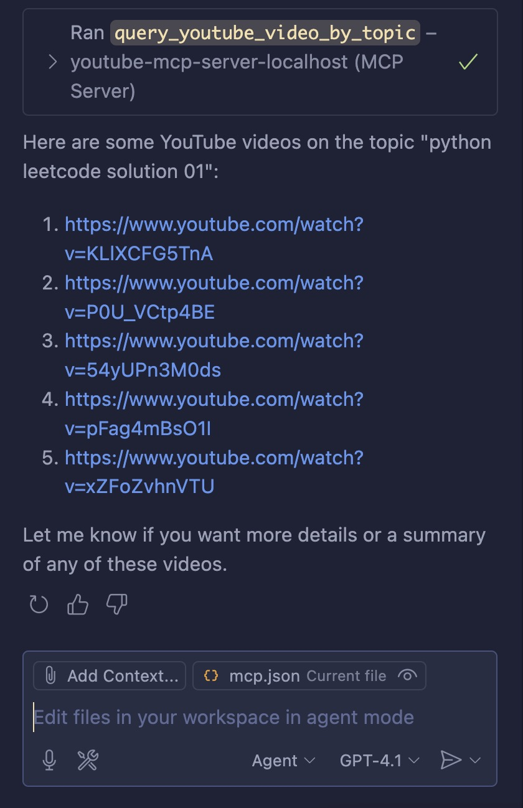

# Youtube MCP server

MCP server to query youtube videos by topic / video title



## How to Setup

You need the following env variables

```bash
YOUTUBE_API_KEY=<your_youtube_api_key>
APP_VERSION="1.0.0"
APP_PORT=8000
```

## Querying YouTube Videos by Topic Using URLs

To query YouTube for videos related to a specific topic and obtain their URLs, you have several options, primarily centered around the YouTube Data API.

## YouTube Data API Approach

The most robust and official way to search for YouTube videos by topic is to use the YouTube Data API's search.list endpoint. This allows you to specify a query term (the topic) and receive a list of matching videos, including their URLs. Here’s how it works:

- You make a request to the search.list endpoint with parameters such as q (your topic keyword), type=video, and part=snippet.
- The API returns a JSON response containing video IDs.
- You can construct the video URL using the format: `https://www.youtube.com/watch?v=VIDEO_ID`

```bash
# curl command
GET https://www.googleapis.com/youtube/v3/search?part=snippet&q=YOUR_TOPIC&type=video&key=YOUR_API_KEY
```

## Constructing the Video URL:
Each video in the response has an id.videoId field.
The URL for a video is: `https://www.youtube.com/watch?v=VIDEO_ID`

## Topic-based Filtering

The search.list endpoint also supports a topicId parameter for more precise topic filtering,
but this requires knowing the specific topic ID in advance.

For general keyword searches, just use the `q` parameter.

## Direct YouTube URL Search (Without API)

If you want to search directly via a URL (without using the API), you can use YouTube’s web search:
